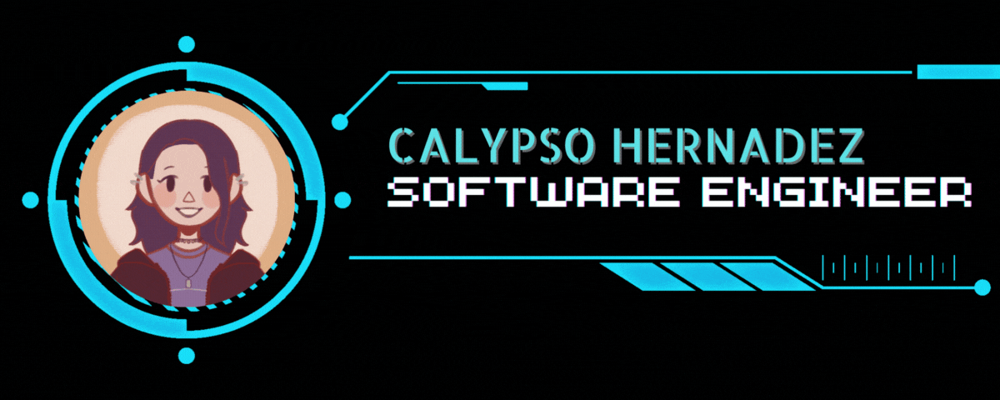

  

  <h3 align="center">Let's Connect!</h3>

  
  
  

###

<h4 align="center">👩‍💻  About Me</h4>

###

Hi, my name is Calypso. I'm a software developer, originally from South Florida and now based in Georgia. I love creating fun, user-friendly web applications with clean, aesthetic designs.. I have a unique blend of experience in both theatre and software development, I bring a diverse skill set to any project I undertake. My background in technical theatre has honed my ability to manage complex projects, coordinate with multidisciplinary teams, and maintain meticulous attention to detail under tight deadlines. In software development, I have applied these organizational skills to coding, developing proficiency in languages such as JavaScript and TypeScript. This combination of creative problem-solving and technical acumen allows me to approach challenges from multiple angles, delivering innovative solutions that are both practical and efficient.

###

<h4 align="center">TECH STACK</h4>

###

  
  
  
  
  
  
  
  
  
  
  
  
  
  
  
  
  
  
  
  
  
  
  
  
  
  
  
  
  
  
  
  
  
  
  
  
  
  
  
  
  

###
